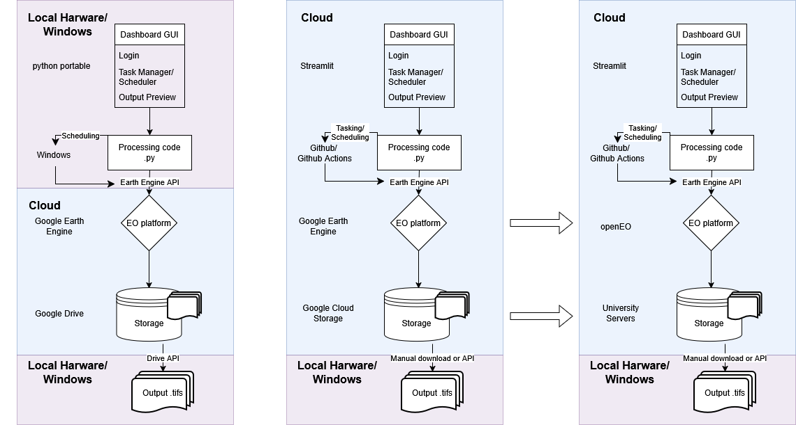

# Transient Hydrologic Anomalies Weekly (THAW) 
*A tool for the detection and monitoring of anomalous and potentially hazardous water bodies*

**THAW** is an automated pipeline and dashboard for monitoring surface water bodies over time using **Sentinel-1 Synthetic Aperture Radar (SAR)** and **Google Earth Engine (GEE)**. This version is designed to run locally via a portable Python environment, supporting both manual processing for specific dates and scheduled, recurring background tasks. 

*Note: Choose this version if you want to use the tool locally with your own google earth engine account and google drive storage, and if you want the result-images to download automatically to your local computer*

---

## Features
- **Surface Water Detection** from Synthetic Aperture Radar (Sentinel1-SAR) data given a user-define area of interest (AOI). Determination of the anomaly of the latest backscatter data to historic backscatter phenology in each pixel, expressed as a composite z-score for the ascending and descending orbits. Unlike optical satellites, Sentinel-1 radar penetrates clouds and delivers observations also during nighttimes, making it ideal for monitoring flooded areas or seasonal lake changes in mountainous regions.

- **Scheduling** (Windows): Scheduled monitoring to run daily, weekly, or monthly and download automatically. The task is configured to trigger automatically as soon as your computer is powered on, in case it was turned off at the scheduled time.

- **Task Monitoring**: View "Last Run" timestamps and Windows success/error directly from the dashboard. A time-stamped log file is written to the output folder with the print-outs and errors from each run.

- **Targeted analysis**: Can be used to process any date within the timeframe of Sentinel1-SAR (2014 - present). *Event-level tracking is a work-in-progress feature*. Processing progress is displayed on the dashboard

- **Results & Preview**: Visualize processed data with specialized layers:
  - Z-Score: Identifies anomalies relative to historical water extent.

    > $$z = \frac{x - \mu}{\sigma}$$
    >
    > **$x$**: Current pixel value (today's radar backscatter).  
    > **$\mu$**: Historical mean (the average of that pixel over time).  
    > **$\sigma$**: Standard deviation (the typical "noise" or fluctuation of that pixel).

  - Potential Water: Probabilistic water masks.

  - Mean Difference: Highlighting gain or loss of water surface area.


 
## Getting Started

### Installation


- **Download the packed folder** by clicking **<>Code - Download ZIP** and unpack it to a location of your choice on your computer.
  
**OR**

- **Clone the Repository** using:
   
   ```bash
   git clone [https://github.com/mountainhydro/THAW.git](https://github.com/your-username/THAW.git)
   cd THAW
   ```
  
- **Open the dasboard** by double-clicking *OPEN_THAW.bat* within the THAW folder.
  **Important**: On the first launch, the system will automatically initialize the portable environment and install required libraries (Streamlit, EE, Rasterio, etc.). This requires a stable internet connection and may take a few minutes.

- Navigate to the **Scheduler** and costumize the task (scheduler or instantaneous run)

  **Instantaneous run**
  - Select run date
  - Select AOI
  
  **Scheduled task**
  - Select the recurrence frequency and timing (One daily, one weekly and one monthly task can currently exist in parallel)

### Authentication

Steps for authenticating are explained on the login page of the Dashboard!

- This application requires a GEE account and a registered GEE project.

- Service Account: You will need a .json key for a Google Cloud Service Account.

- Drive Access: Your Service Account email needs permissions for a folder named GEE_Exports in your Google Drive.

- Persistence: Credentials are saved in the temp/ directory. Your session remains active across restarts until you manually click Logout.


## Project Structure

```text
THAW/
├── Dashboard/            # Streamlit UI files (Main app interface)
├── GEE/                  # Earth Engine processing (lakedetection_headless.py)
├── Outputs/              # Results storage: GeoTIFFs and logs (sorted by date)
├── config/               # Current task JSONs and AOI GeoJSON data
├── temp/                 # Local persistence (gee_credentials.txt)
├── python_portable/      # Isolated Python environment and libraries
└── OPEN_THAW.bat         # Main launcher script (Setup & Boot)
```


## Requirements
OS: Windows 10/11 or higher (Required for schtasks and PowerShell scheduling logic).

GEE: An active Google Earth Engine project.

Permissions: "Run as Administrator" may be required to register new scheduled tasks in Windows.

## Troubleshooting

Logs: If the processing does not finish successfully, look at pipeline_log_[timestamp].txt is generated inside the specific date folder in /Outputs.

Missing Credentials: Check the temp/ folder. If the GEE_credentials are missing, you will need to re-enter your Project ID and JSON path.

Task Errors: Reach out in case you cannot make sense of the error logs, or if you fail to restart the processing (stefan.fugger@unifr.ch)
