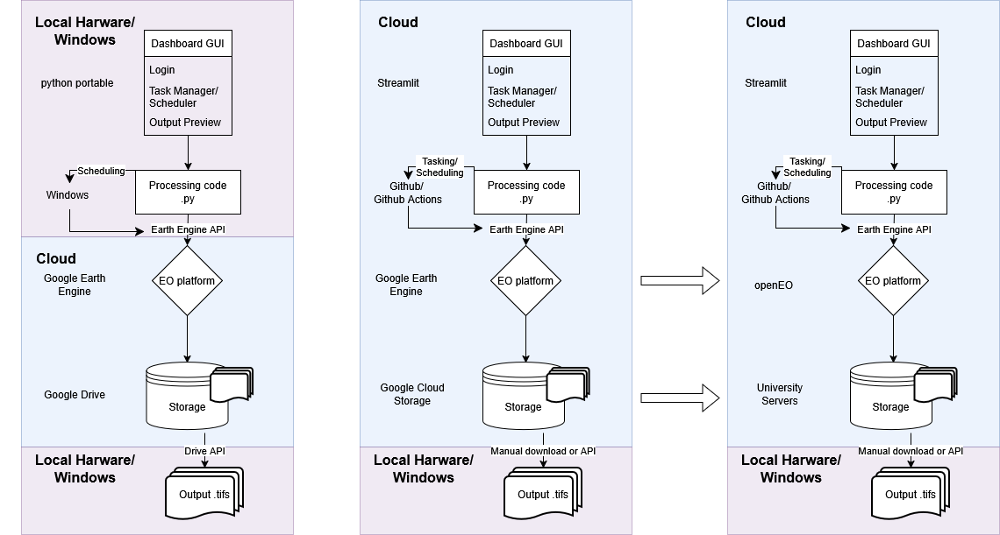

# Transient Hydrologic Anomalies Weekly (THAW) 
*A tool for the detection and monitoring of anomalous and potentially hazardous water bodies*

**THAW** is an automated pipeline and dashboard for monitoring surface water bodies over time using **Sentinel-1 Synthetic Aperture Radar (SAR)** and **Google Earth Engine (GEE)**. This version is designed to run locally via a portable Python environment, supporting both manual processing for specific dates and scheduled, recurring background tasks. Tracking of lakes back in time is also supported.

*Note: Choose this version if you want to use the tool locally with your own google earth engine account and google drive storage, and if you want the result-images to download automatically to your local computer*

---

[](https://youtu.be/Eg3_Jr2FksA)

## Features Overview
- **Surface Water Detection** from Synthetic Aperture Radar (Sentinel1-SAR) data given a user-define area of interest (AOI). Determination of the anomaly of the latest backscatter data to historic backscatter phenology in each pixel, expressed as a composite z-score for the ascending and descending orbits. Unlike optical satellites, Sentinel-1 radar penetrates clouds and delivers observations also during nighttimes, making it ideal for monitoring flooded areas or seasonal lake changes in mountainous regions.

- **Scope**: Can be used over any mountain area globally, for areas up to 60,000 km<sup>2</sup>, for any date within the timeframe of Sentinel1-SAR (2014 - present). *Event-level tracking is a work-in-progress feature*. 

- **Lake detection and tracking**: Water bodies appearing anomalous compared to the historical collection of images (10 years back), are automatically flagged and a summary is presented in the *Output and Tracking* window. A ruler can be used to measure lake sizes. In a secondary *tracking* step, the user can select a focus-area and track lakes back in time. The user can pan through the timetagged images and observe the lake evolution. A graph presenting lake area evolution over time is additionally presented.

- **Scheduling** (Windows): Scheduled monitoring to run daily, weekly, or monthly and download automatically. The task is configured to trigger automatically as soon as your computer is powered on, in case it was turned off at the scheduled time.

- **Output**: Visualize processed data with three specialized layers that can be turned on and off:
  - Z-Score: Identifies anomalies relative to historical water extent.

    > $$z = \frac{x - \mu}{\sigma}$$
    >
    > **$x$**: Current pixel value (today's radar backscatter).  
    > **$\mu$**: Historical mean (the average of that pixel over time).  
    > **$\sigma$**: Standard deviation (the typical "noise" or fluctuation of that pixel).

  - Potential Water: Probabilistic water masks.

  - Mean Difference: Highlighting gain or loss of water surface area.

- **Task Monitoring**: For manual analysis, processing progress is displayed on the dashboard. An overview of scheduled tasks is presented including "Last Run" timestamps and Windows success/error on the *Scheduler* page. A time-stamped log file is written to the output folder with the print-outs and errors from each run.

 
## Getting Started

### Installation


- **Download the packed folder** by clicking **<>Code - Download ZIP** and unpack it to a location of your choice on your computer.
  
**OR**

- **Clone the Repository** (git users) using:
   
   ```bash
   git clone [https://github.com/mountainhydro/THAW.git](https://github.com/your-username/THAW.git)
   cd THAW
   ```
  
- **Open the dasboard** by double-clicking *OPEN_THAW.bat* within the THAW folder.
  **Important**: On the first launch, the system will automatically initialize the portable environment and install required libraries (Streamlit, EE, Rasterio, etc.). This requires a stable internet connection and may take a few minutes.


## Authentication
A step-by-step setup guide is available on the Dashboard login page.

- Requires a GEE account and a registered GEE project
  
- Authentication uses an OAuth 2.0 client secret (Desktop app type), downloaded from Google Cloud Console
  
- On first login, a browser window opens once to authorise Earth Engine and Google Drive access — the token is saved automatically and reused on all subsequent runs
  
- Credentials are stored in temp/ and persist across restarts until you click Logout


### Launching tasks

- Navigate to the **Scheduler** and costumize the task (scheduler or instantaneous run)

  **Instantaneous run**
  - Select a task name (e.g. "Langtang")
  - Select run date
  - Select AOI (up to 60,000 km<sup>2</sup>)
    
  **Scheduled task**
  - Select the recurrence frequency and timing (One daily, one weekly and one monthly task can currently exist in parallel)


## Project Structure

```text
THAW/
├── Dashboard/            # Streamlit UI files (Main app interface)
├── docs/                 # files for documenting the tool
├── GEE/                  # Earth Engine processing, tracking and helper modules (lakedetection_headless.py)
├── Outputs/              # Results storage: GeoTIFFs and logs (sorted by date)
├── config/               # Current task JSONs and AOI GeoJSON data
├── temp/                 # Local persistence (gee_credentials.txt)
├── python_portable/      # Isolated Python environment and libraries
└── OPEN_THAW.bat         # Main launcher script (Setup & Boot)
```


## Requirements
OS: Windows 10/11 or higher (Required for schtasks and PowerShell scheduling logic).

GEE: An active Google Earth Engine project.

Permissions: "Run as Administrator" may be required to register new scheduled tasks in Windows.

## Troubleshooting

Logs: If the processing does not finish successfully, look at pipeline_log_[timestamp].txt is generated inside the specific date folder in /Outputs.

Missing Credentials: Check the temp/ folder. If the GEE_credentials are missing, you will need to re-enter your Project ID and JSON path.

Task Errors: Reach out by creating an issue in case you cannot make sense of the error logs, or if you fail to restart the processing.
